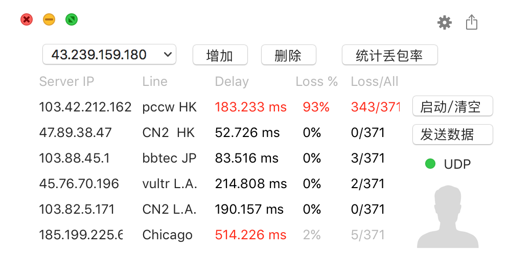

# osx_ping
用于vps线路丢包检测统计, multiping的mac版本 
# 运行
xcode直接运行osx_ping.xcodeproj项目文件
# 效果图

# 说明
1. 红色字体表示当前为丢包状态

2. Loss为当前线路丢包统计

3. 程序Loss/All总次数每小时清空一次

4. 单击上方空白区域可以快速隐藏app
# 替换ip
更新MainView.swift里的server_ip_*变量值
